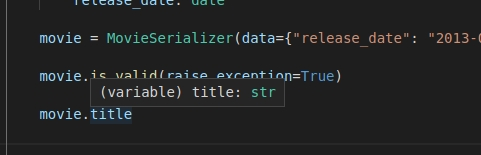
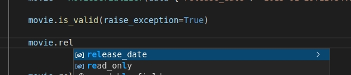

# Django REST - Typed

[](https://pypi.python.org/pypi/drf-typed)
[](https://img.shields.io/pypi/status/drf-typed.svg/)
[](https://pypi.org/project/drf-typed/)


This project extends [Django REST Framework](https://www.django-rest-framework.org/) to allow use of Python's type hints for automatically validating view parameters, as well as supporting typed attributes and annotation-generated fields on serializers.

Deriving automatic behavior from type annotations has become increasingly popular with the [FastAPI](https://fastapi.tiangolo.com/) and [Django Ninja](https://django-ninja.rest-framework.com/) frameworks. The goal of this project is to provide these benefits to the DRF ecosystem.

Main benefits:

- View inputs can be individually declared, not buried inside all-encompassing `request` objects.
- Type annotations can replace repetitive view validation/sanitization code.
- Simple serializers can have their fields auto-generated from annotations
- Validated serializer data can be accessed from attributes, with their types known to the IDE
- [Pydantic](https://pydantic-docs.helpmanual.io/) models are compatible types for view parameters. Annotate your POST/PUT functions with them to automatically validate incoming request bodies.

**Documentation**: <a href="https://rsinger86.github.io/drf-typed/" target="_blank">https://rsinger86.github.io/drf-typed</a>

**Source Code**: <a href="https://github.com/rsinger86/drf-typed/" target="_blank">https://github.com/rsinger86/drf-typed</a>

## Views Example

```python
from rest_typed.views import typed_api_view

"""
GET /users/registered/?registered_on=2019-03-03&staff=yes
"""

@typed_api_view(["GET"])
def get_users(registered_on: date = None, staff: bool = None):
    print(registered_on, is_staff)
    # date(2019, 3, 3) True
    data = query_orm(registered_on, is_staff)
    return Response(data)
```

## Serializers Example

```python
from datetime import date
from rest_typed.serializers import TSerializer


class MovieSerializer(TSerializer):
    title: str          # same as: CharField(required=True, allow_null=False)
    release_date: date  # same as: DateField(required=True, allow_null=False)
    description = None  # same as: DateField(default=None)

movie = MovieSerializer(data={
  "title": "The Last Duel",
  "release_date": "2021-10-15",
})

movie.is_valid(raise_exception=True)

print(movie.validated_data)
"""
  {
    "title": "The Last Duel",
    "release_date": date(2021, 10, 15),
    "description": None
  }
"""

# Or access attributes directly:
print(movie.title) # The Last Duel
print(movie.release_date) # date(2021, 10, 15)
```

The IDE can help you understand types and auto-complete attributes:





---

# Install

Install using:

```
pip install drf-typed

```

Python 3.8 or higher is required.

# Changelog

## 0.2.0 (January 2022)

- Fixes setup.py for finding packages

## 0.1.3 (October 2021)

- Fixes setup.py for finding packages

## 0.1.1 (October 2021)

- Docs improvements
- Updates setup.py to include stubs package

## 0.1.0 (October 2021)

- First release

# Testing

Tests are found in a simplified Django project in the `/tests` folder. Install the project requirements and do `./manage.py test` to run them.

# License

See [License](LICENSE.md).
