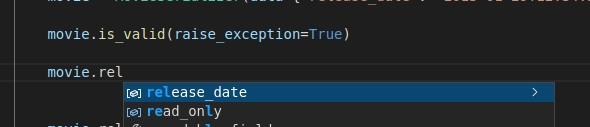

# Django REST Framework - Typed

## Overview

[](https://pypi.python.org/pypi/drf-typed-views)
[](https://img.shields.io/pypi/status/drf-typed-views.svg/)

This project extends [Django REST Framework](https://www.django-rest-framework.org/) to allow use of Python's type annotations for automatically validating/casting view parameters and augmenting serializers with typed attributes and annotation-generated fields.

Deriving automatic behavior from type annotations has become increasingly popular with the FastAPI and Django Ninja frameworks. The goal of this project is to provide these benefits to the DRF ecosystem.

Main benefits:

- View inputs can be individually declared, not buried inside all-encompassing `request` objects.
- Type annotations can replace repetitive view validation/sanitization code.
- Simple serializers can have their fields auto-generated from annotations
- Validated serializer data can be accessed from attributes, with their types known to the IDE
- [Pydantic](https://pydantic-docs.helpmanual.io/) models and [Marshmallow](https://marshmallow.readthedocs.io) schemas are compatible types for view parameters. Annotate your POST/PUT functions with them to automatically validate incoming request bodies.
- Advanced validators for more than just the type: `min_value`/`max_value` for numbers
- Validate string formats: `email`, `uuid` and `ipv4/6`; use Python's native `Enum` for "choices" validation

## Quick example - views

```python
from rest_typed.views import typed_api_view

@typed_api_view(["GET"])
def get_users(registered_on: date = None, groups: List[int] = None, staff: bool = None):
    print(registered_on, groups, is_staff)
```

GET /users/registered/?registered_on=**2019-03-03**&groups=**4,5**&staff=**yes**<br>

```python
# Status code: 200
date(2019, 3, 3)   [4, 5]  True
```

GET /users/?registered_on=**9999**&groups=**admin**&staff=**maybe**<br>

```python
# Status code: 400 / ValidationError raised
{
  "registered_on": "'9999' is not a valid date",
  "groups": "'admin' is not a valid integer",
  "staff": "'maybe' is not a valid boolean"
}
```

## Quick example - serializers

You can use type annotations to generate basic serializer fields automatically.

```python
from datetime import date
from rest_typed.serializers import TSerializer


class MovieSerializer(TSerializer):
    title: str          # --> CharField(required=True, allow_null=False)
    release_date: date  # --> DateField(required=True, allow_null=False)
    description = None  # --> DateField(default=None)

movie = MovieSerializer(data={
  "title": "The Last Duel",
  "release_date": "2021-10-09",
})

movie.is_valid(raise_exception=True)

print(movie.validated_data)
"""
  {
    "title": "The Last Duel",
    "release_date": date(2021, 10, 9),
    "description": None
  }
"""
```

Once you've called `is_valid()`, you can also access validated attributes directly, and if you're using a popular IDE, you should get added type safety:

```python
print(movie.title) # The Last Duel
print(movie.release_date) # date(2021, 10, 9)
print(movie.description) # None
```

IDE can help you understand and enforce types:


IDE can auto-complete attributes:


