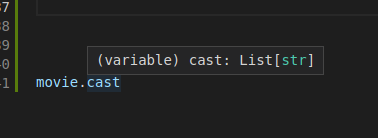
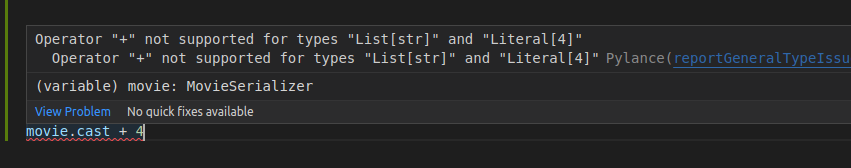

# Typed/Direct Atrribute Access

When using `TSerializer` or `TModelSerializer` you also have direct access to validated field values after calling `is_valid()`:

```python
from datetime import date
from rest_typed.serializers import TSerializer

class Genre(Enum):
    comedy = "comedy"
    drama = "drama"


class MovieSerializer(TSerializer):
    release_date: date
    genre: Genre
    cast: List[str]

movie = MovieSerializer({
    'release_date': '2021-10-10',
    'genre': 'drama',
    'cast': ['Steve Martin']
})

movie.is_valid()

print(movie.cast)
# ['Steve Martin']
```

Just like with standard REST Framework serializers, if you attempt to access validated fields before calling `is_valid()`, an exception will be raised.

Now that we're accessing class instance attributes, rather than dictionary keys in `.validated_data`, the IDE can remind us of the types:



It can also help us catch more errors:


