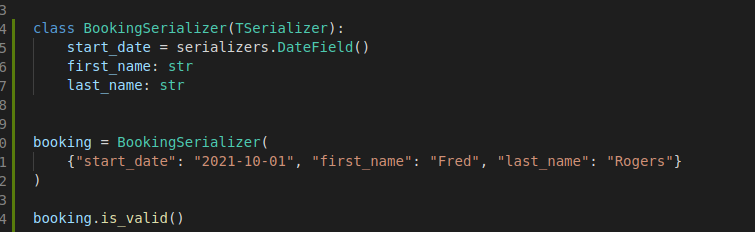
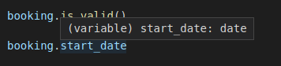

# IDE Integration

Classes are used to represent serializer fields, which can confuse IDEs into assuming that field values should be instances of those classes, rather than the value type that the class is responsible for validating and deserializing.

The project includes a set of type stubs copied from [typeddjango/django-stubs](https://github.com/typeddjango/django-stubs) (credit due to them for excellent work) and altered to indicate deserialized field types and address the problem stated above.

This allows your IDE to know that `start_date` is of type `datetime.date`, even though a type annotation was not used.

